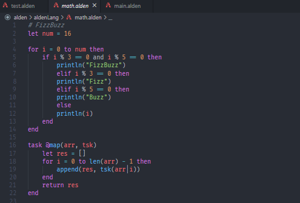
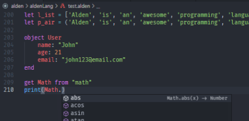

# AldenLans

A feature-rich language support for Alden in VS Code

## Features

* [Syntax Highlighting]("https://aldenlang.org/guide/syntax-highlighting")
* [Snippets]("https://aldenlang.org/guide/snippets")
* [Formatting]("https://aldenlang.org/guide/formatting")
* [Code Completion]("https://aldenlang.org/guide/code-completion")

### Syntax highlighting

 
<em>(Syntax highlighting)</em>

### Auto Completion

 
<em>(Auto Completion)</em>

